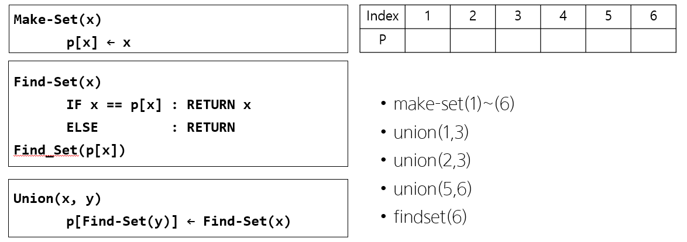

# Disjoint set(상호배타 집합, 서로소 집합)




## 1. 기본 정의

[여기](https://ko.wikipedia.org/wiki/%EC%84%9C%EB%A1%9C%EC%86%8C_%EC%A7%91%ED%95%A9_%EC%9E%90%EB%A3%8C_%EA%B5%AC%EC%A1%B0)를 참고하여 `make_set`, `union`, 그리고 `find_set` 연산의 의미를 간단하게 작성하시오.

### **`make_set`**

Make_Set(x)는 유일한 멤버 x를 포함하는 새로운 집합을 생성하는 연산이다.

### **`union`**

Union(x, y)는 x와 y를 포함하는 두 집합을 통합하는 연산이다.

일반적으로 앞에 있는 원소를 가지는 집합에 뒤에 있는 원소를 가지는 집합을 포함시킨다.

### **`find_set`**

Find_set(x) 연산은 x원소를 가진 집합의 대표 원소를 찾는 연산이다.


## 2. 아래 연산 수행 결과를 표/값으로 나타내시오.

`make_set`

- **make_set(1) ~ make_set(6)**

    | Index |  1   |  2   |  3   |  4   |  5   |  6   |
    | :---: | :--: | :--: | :--: | :--: | :--: | :--: |
    |   p   |  1   |  2   |  3   |  4   |  5   |  6   |


`union`

- **union(1, 3)**

    | Index |  1   |  2   |  3   |  4   |  5   |  6   |
    | :---: | :--: | :--: | :--: | :--: | :--: | :--: |
    |   p   |  1   |  2   |  1   |  4   |  5   |  6   |

- **union(2, 3)**
	
    | Index |  1   |  2   |  3   |  4   |  5   |  6   |
    | :---: | :--: | :--: | :--: | :--: | :--: | :--: |
    |   p   |  2   |  2   |  1   |  4   |  5   |  6   |
    
- **union(5, 6)**
	
    | Index |  1   |  2   |  3   |  4   |  5   |  6   |
    | :---: | :--: | :--: | :--: | :--: | :--: | :--: |
    |   p   |  2   |  2   |  1   |  4   |  5   |  5   |


`find_set`

- 인덱스에 변화는 없지 않나요?

- **find_set(6)**
	
	- 5 출력
	
	| Index |  1   |  2   |  3   |  4   |  5   |  6   |
	| :---: | :--: | :--: | :--: | :--: | :--: | :--: |
	|   p   |  2   |  2   |  1   |  4   |  5   |  5   |
	
- **find_set(3)**

  - 2 출력

  | Index |  1   |  2   |  3   |  4   |  5   |  6   |
  | :---: | :--: | :--: | :--: | :--: | :--: | :--: |
  |   p   |  2   |  2   |  1   |  4   |  5   |  5   |

- **find_set(2)**

  - 2 출력

  | Index |  1   |  2   |  3   |  4   |  5   |  6   |
  | :---: | :--: | :--: | :--: | :--: | :--: | :--: |
  |   p   |  2   |  2   |  1   |  4   |  5   |  5   |


## 3. 코드 구현

```python
def make_set(x):
    p[x] = x

def find_set(x):
    # 반복
    while x != p[x]:
        x = p[x]
    return x
    
    # 재귀
    # if x != p[x]:
    #     p[x] = find_set(p[x])
    # return p[x]

def union(x, y):
    p[find_set(y)] = find_set(x)

#1.
p = [0] * (6+1)

for i in range(1, 7):
    make_set(i)

print(p)
print('----------------------------------')

#2.
union(1, 3)
print(p)
print('----------------------------------')

union(2, 3)
print(p)
print('----------------------------------')

union(5, 6)
print(p)
print('----------------------------------')

#3.
print(find_set(6))
print(find_set(3))
print(find_set(2))
```

